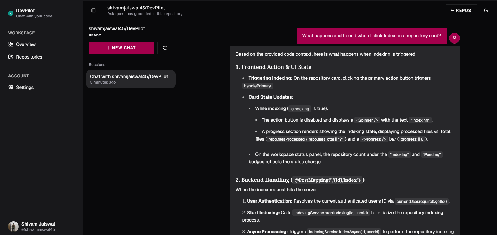
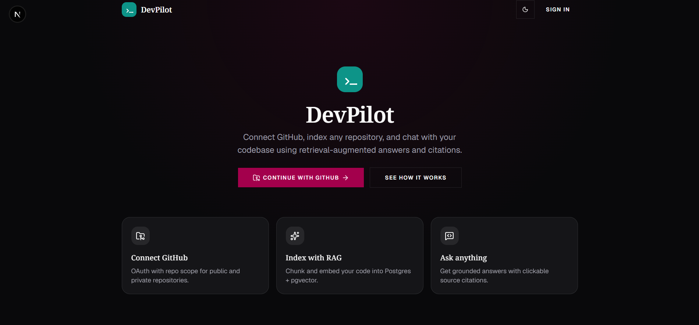
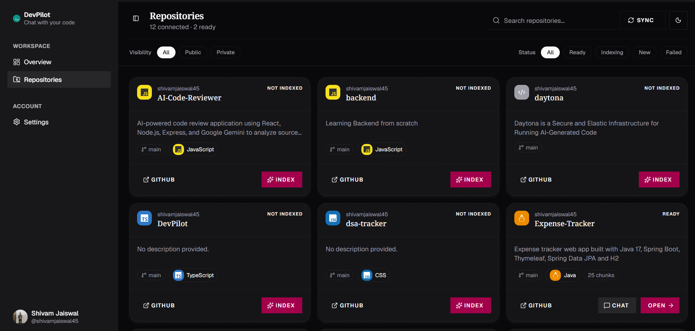
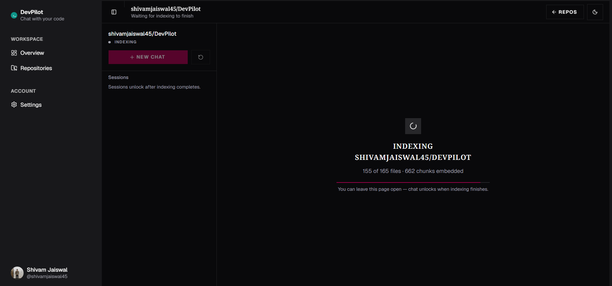
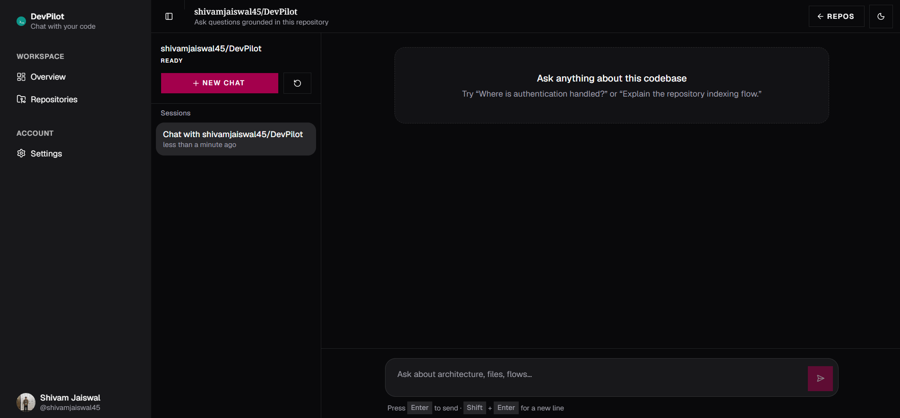
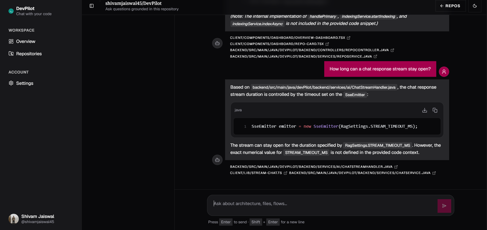

<h1 align="center">&gt;_ DevPilot</h1>

<p align="center">
  <b>Chat with your GitHub code. Get answers with receipts.</b>
</p>

<p align="center">
  
</p>

<p align="center">
  <sub>^ DevPilot answering questions about its own source code.</sub>
</p>

---

## What it does

Sign in with GitHub, pick a repository, and DevPilot reads the code once and remembers it.
After that you can ask questions in plain English. It answers from your real files and shows you which ones it used.

## How it works

```
 your repo
    │   split the code into small chunks
    ▼
 chunks ──► turned into numbers (embeddings) ──► stored in Postgres (pgvector)
                                                          │
 your question ──► find the 8 most similar chunks ◄───────┘
                          │
                          ▼
        Gemini reads only those chunks + your question
                          │
                          ▼
              answer  +  the files it came from
```

This pattern is called RAG. Instead of making the AI read an entire repo, you hand it just the pieces that matter.

## See it

<table>
  <tr>
    <td width="50%"><br><sub><b>Sign in with GitHub</b></sub></td>
    <td width="50%"><br><sub><b>Pick a repo</b></sub></td>
  </tr>
  <tr>
    <td width="50%"><br><sub><b>Watch it index</b></sub></td>
    <td width="50%"><br><sub><b>Start asking</b></sub></td>
  </tr>
</table>

<p align="center">
  <br>
  <sub>The chips under an answer are the files it used. When the chunks didn't contain what it needed, it said so instead of guessing.</sub>
</p>

## Try asking it

- "Where is authentication handled?"
- "Explain the repository indexing flow."
- "How are GitHub tokens stored?"
- "Does this project use Redis?" (it should say no)

## Run it

You need JDK 21, Node 20.9+, Docker, and a free Gemini API key from [Google AI Studio](https://aistudio.google.com/).

**1. Make a GitHub OAuth app** (GitHub → Settings → Developer settings → OAuth Apps → New)

- Homepage URL: `http://localhost:3000`
- Callback URL: `http://localhost:8080/login/oauth2/code/github`

**2. Clone it and start the database**

```bash
git clone https://github.com/shivamjaiswal45/DevPilot.git
cd DevPilot
docker compose up -d
```

**3. Add your keys**

```bash
cd backend
cp .env.example .env        # Windows PowerShell: copy .env.example .env
```

Open `backend/.env` and fill in `GEMINI_API_KEY`, `GITHUB_CLIENT_ID`, `GITHUB_CLIENT_SECRET`, and your own `TOKEN_ENCRYPTOR_PASSWORD` and `TOKEN_ENCRYPTOR_SALT` (the salt must be a hex string, like `deadbeefcafebabe`). No quotes around values.

**4. Start the backend** (run it from the `backend` folder)

```bash
./mvnw spring-boot:run      # Windows PowerShell: .\mvnw spring-boot:run
```

**5. Start the frontend**

```bash
cd ../client
npm install
npm run dev
```

Open **http://localhost:3000**, sign in, and index a small repo first.

## Built with

**Backend:** Java 21, Spring Boot 4, Spring Security (GitHub OAuth), Spring Data JPA, Spring AI + Google Gemini
**Database:** PostgreSQL 16 + pgvector (Docker)
**Frontend:** Next.js 16, React 19, TypeScript, Tailwind CSS, shadcn/ui

## Things that broke (and got fixed)

- Google retired its old embedding model, so indexing moved to `gemini-embedding-001`.
- The free tier allows 100 embedding calls a minute, so indexing now paces itself and retries.
- Indexing errors used to disappear quietly. Now the real error shows on the repo card.
- The page could stay on "Indexing" after the backend had finished. That's fixed too.

## Limits

- Every question is answered on its own, so there's no chat memory yet.
- Sources show the file, not the line.
- It runs locally, and the code chunks it searches are sent to Gemini.

<p align="center"><sub>Built by <a href="https://github.com/shivamjaiswal45">Shivam Jaiswal</a></sub></p>
